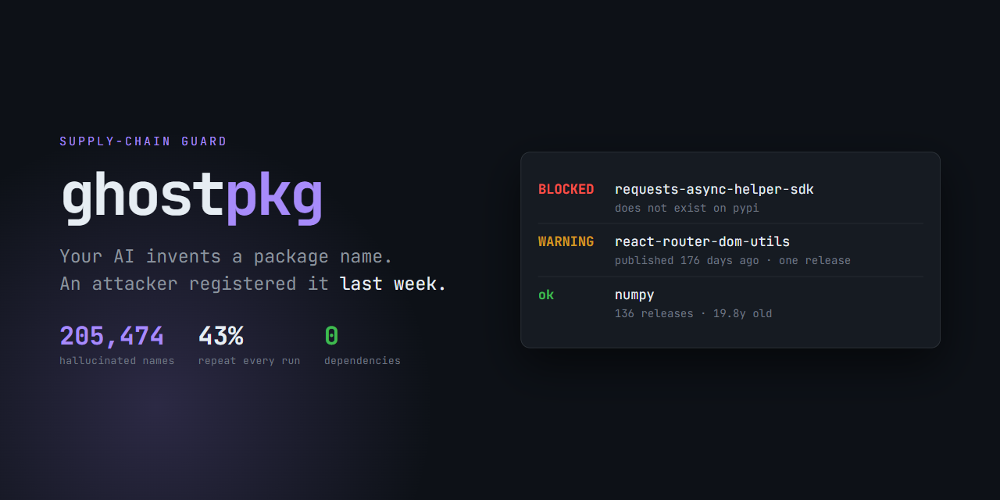
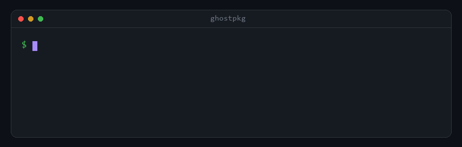

<div align="center">



<h1>ghostpkg</h1>

**Зупиняє встановлення пакетів, яких не існує.**

Мовні моделі вигадують назви бібліотек. Зловмисники реєструють ці назви наперед.
`ghostpkg` перевіряє назву в реальному реєстрі — до того, як `pip` або `npm` щось завантажать.

[English](README.en.md) · **Українська**

[](https://github.com/M1rwana12/ghostpkg/actions/workflows/ci.yml)
[](https://pypi.org/project/ghostpkg/)
[](https://pypi.org/project/ghostpkg/)
[](pyproject.toml)
[](LICENSE)

</div>

---

## Проблема

Дослідження ~200 000 запитів на генерацію коду виявило **205 474 унікальні вигадані назви пакетів**.
Найгірше не це, а ось що:

> **43 % галюцинацій повторювалися в усіх десяти повторних запусках того самого запиту.**

Тобто вони **передбачувані**. Зловмисник може заздалегідь дізнатися, що саме вигадає модель,
зареєструвати цю назву в PyPI чи npm — і чекати. Коли ваш агент упевнено напише
`pip install fastapi-middleware`, пакет там **уже буде**.

Атака має назву — **slopsquatting**.

---

## Рішення

<div align="center">
  
</div>

Код виходу — `1`, якщо щось заблоковано. Тому інструмент без переробок стає на місце
в CI або в хук перед встановленням.

---

## Встановлення

```bash
pip install ghostpkg
```

<details>
<summary>Інші способи</summary>

```bash
uvx ghostpkg check requests      # запустити без встановлення
pipx install ghostpkg            # ізольовано, глобальна команда
```

</details>

> [!NOTE]
> **Нуль залежностей.** Тільки стандартна бібліотека Python.
> Інструмент безпеки ланцюга постачання, який сам тягне за собою дерево залежностей, —
> сумнівна ідея. Тут його немає.

---

## Використання

```bash
# перевірити конкретні назви (можна із закріпленою версією)
ghostpkg check fastapi-middleware requests==99.99.99

# перевірити назву в npm
ghostpkg check react-router-dom-utils -e npm

# перевірити всі залежності з маніфесту
ghostpkg scan requirements.txt
ghostpkg scan pyproject.toml
ghostpkg scan package.json

# машинозчитуваний вивід
ghostpkg check somepkg --json

# видалити кеш
ghostpkg clear-cache
```

Результати запитів кешуються на диск: повторна перевірка маніфесту зі 150
залежностей займає 0,4 с замість 4,7 с. **Відповідь «пакета не існує» не
кешується взагалі** — це єдина відповідь, яка блокує, тож вона має бути свіжою
в обидва боки. Вільне ім'я можуть зареєструвати будь-якої миті, і саме в цьому
вся атака; а щойно опублікований пакет якийсь час віддає 404, бо стрічка PyPI
оголошує його раніше, ніж його починає віддавати JSON API. Кешування цієї
відповіді на годину вже дало справжнє хибне блокування живого пакета.
Закріплена версія теж перевіряється за свіжим списком, перш ніж заблокувати.

| Прапорець | Призначення |
|---|---|
| `-e`, `--ecosystem` | `pypi` (типово) або `npm`. Лише для `check` — `scan` визначає екосистему з файлу |
| `--format` | `text` (типово), `json`, або `github` для анотацій на діф |
| `--config PATH` | Ignore-файл. Ніколи не читається з каталогу, який сканують |
| `--strict` | Підвищує попередження до блокувань |
| `--json` | Вивід у JSON для скриптів і CI |
| `-q`, `--quiet` | Ховає пакети, які пройшли перевірку |
| `--no-cache` | Не читати й не писати кеш |
| `--deep` | Завантажити свіжі пакети й статично перевірити їхні скрипти встановлення |
| `--workers N` | Скільки запитів паралельно (типово 8) |
| `--timeout SECONDS` | Тайм-аут на запит |

`scan` розпізнає `requirements*.txt`, `pyproject.toml` (PEP 621, PEP 735 і Poetry),
`package.json`, а також **lock-файли**: `package-lock.json`, `yarn.lock`
(classic і berry), `pnpm-lock.yaml`, `poetry.lock`, `uv.lock`.
Невідомий формат він **відхиляє з помилкою, а не вгадує**.

Lock-файли варто перевіряти навіть якщо ви вже перевіряєте маніфест: **CI
встановлює саме з них**, тож там лежать імена, які справді завантажуються —
включно з транзитивними, яких у маніфесті немає. І кожен запис має точну версію,
отже перевіряється повністю.

**Читає й прозу** — `README`, `AGENTS.md`, `CLAUDE.md`, `.cursorrules`,
`.windsurfrules`, і будь-який `.md`, названий прямо. При пошуку в каталозі
беруться лише файли інструкцій для агентів та README **у корені** — інакше
великий репозиторій завалив би вивід чейнджлогами.
Це закриває проблему порядку: **галюцинація з'являється раніше за маніфест**. Модель
пише `pip install foo-bar` у README, людина копіює рядок — і встановлення вже відбулось,
коли назва тільки потрапляє в `requirements.txt`.

Читаються й команди, написані **всередині речення**, у зворотних лапках —
*«Install using `pip install -U pydantic`»*. Три з чотирнадцяти популярних README
пишуть їх лише так, і читання цілих рядків не знаходило в них нічого.

Витяг навмисно вузький, бо README повний слів, схожих на назви пакетів. Замір на
22 реальних README: **18 назв, хибних спрацювань 0%**.

Можна передати кілька файлів одразу, навіть із різних екосистем:

```bash
ghostpkg scan requirements.txt package.json pnpm-lock.yaml
```

Або просто вказати каталог — чи взагалі нічого, і тоді перевіриться поточний:

```bash
ghostpkg scan          # шукає маніфести у поточному каталозі
ghostpkg scan ../інший-проєкт
```

Пошук обходить `node_modules`, `.venv`, `.git`, `dist` та інші чужі й
згенеровані теки, а **lock-файл витісняє маніфест поруч із собою** — lock це
той самий маніфест, уже вирішений, тож читати обидва означає двічі надрукувати
ті самі пакети.

---

## Монорепо й приватні пакети

Залежність, яка **сама називає своє джерело**, публічного реєстру не стосується —
і `ghostpkg` її не шукає. Без цього правила монорепо перетворюється на стіну
хибних блокувань: замір на одному справжньому `package.json` дав **шість із дев'яти**.

| Як написано | Що відбувається |
|---|---|
| `"@acme/ui": "workspace:*"`, `"catalog:default"` | Пропускаємо — вирішується всередині репозиторію |
| `"lib": "file:../lib"`, `"link:"`, `"portal:"`, `"../sibling"` | Пропускаємо — тека на диску |
| `"forked": "git+https://..."`, `"owner/repo"`, `"github:owner/repo"` | Пропускаємо — git-хост |
| `"dep": "https://.../x.tgz"` | Пропускаємо — URL |
| `"ui": "npm:@scope/real@^2"` | Перевіряємо **`@scope/real`** — псевдонім встановлює не те, що в ключі |
| `internal @ git+https://...` у requirements | Пропускаємо |
| `[tool.uv.sources]`, Poetry `{ git = ... }` / `{ path = ... }` | Пропускаємо |
| `[package.source]` у `poetry.lock`, `source = { git = ... }` в `uv.lock` | Пропускаємо |
| Учасник робочої області або git-джерело в `package-lock.json` | Пропускаємо |

Те саме правило закриває **приватний реєстр**. Artifactory, Nexus і Verdaccio
проксюють публічні імена **і** хостять власні під тим самим хостом, а lock-файл
не каже, що є що — тож такі записи ми лишаємо без судження, а не вгадуємо.
Публічні дзеркала (`registry.yarnpkg.com`, `registry.npmmirror.com`) перевіряємо
далі, бо вони віддають той самий публічний простір імен.

> Це знайшлося, коли `ghostpkg` навели на власний `pyproject.toml` проєкту
> `pydantic` — і він його заблокував. `pydantic-docs` оголошено в групі
> залежностей і перенаправлено на git через `[tool.uv.sources]`; на PyPI його
> немає, і називати це відсутньою залежністю було просто неправильно.

---

## Куди це вбудовується

### У CI

```yaml
- uses: M1rwana12/ghostpkg@v0.24.3
```

Це весь крок. Він шукає маніфести в чекауті, обходить `node_modules` і подібні
теки, і **лишає анотацію просто на рядку в дифі pull request**, а не відповідь
десь у логах:

```
::error file=requirements.txt,line=12,title=ghostpkg GP001::fastapi-auth-helper: does not exist on pypi
```

Блокувальна знахідка — помилка, м'який сигнал — попередження, тож анотації й код
виходу не суперечать одне одному.

Необов'язкові входи: `paths`, `strict`, `deep`, `version`, `install`, `config`,
`python-version`, `fail-on-error`. `config` вказує на ignore-файл у самому
репозиторії — цей проєкт тримає свій у `.github/ghostpkg-ignore.json`, тож
придушення проходить рев'ю як звичайна зміна.

### Як хук pre-commit

```yaml
repos:
  - repo: https://github.com/M1rwana12/ghostpkg
    rev: v0.24.3
    hooks:
      - id: ghostpkg
```

Хук отримує лише ті staged-файли, що підходять, тож коштує один запит на змінену
залежність, а не повний скан на кожен коміт.

---

## Що саме перевіряється

| Сигнал | Вердикт |
|---|---|
| Немає в реєстрі | 🔴 **Заблоковано.** Назва — привид, встановлювати нічого. |
| ...і вона за один-два символи від популярної | 🔴 Заблоковано **з підказкою**: `did you mean requests?` Віковий фільтр, який стримує це порівняння в інших місцях, захищає легітимні пакети від звинувачення в опечатці — у неіснуючої назви захищати нічого, вона вже заблокована. Замір: правильно 11 з 11 на опечатках, мовчить 6 з 6 на вигаданих назвах. |
| Реєстр вилучив це ім'я через шкідливість | 🔴 **Заблоковано.** npm не видаляє таке ім'я, а замінює його заглушкою — тому воно досі відповідає, і раніше ми казали «ok». Приклади: `crossenv`, `ffmepg`. |
| Закріплену версію відкликав мейнтейнер | 🟡 Попередження з його ж поясненням. Не блокування: `pip` встановлює відкликану версію, якщо її закріпили явно. |
| Закріплена версія не існує (`requests==99.99.99`) | 🔴 **Заблоковано.** Вигадана версія — той самий клас помилки, що й вигадана назва. Діапазони (`>=2.31`, `^4.18`) не перевіряються: їх може задовольнити інша версія. |
| Опубліковано днями тому | 🟡 Попередження. Зловмисники реєструють швидко — але й чесні автори теж. |
| Лише один реліз, **і пакету менше року** | 🟡 Попередження. Усталений пакет з одним релізом — просто завершений, тож віковий фільтр тут частина сигналу. |
| Немає посилання на репозиторій, **і пакету менше року** | 🟡 Попередження. Віковий фільтр із тієї ж причини, що й рядком вище. |
| За один-два символи від популярної назви, **і** пакет свіжий **або** занедбаний (≤2 релізи й немає репозиторію) | 🟡 Попередження. Схоже на typosquat. |

---

## Чому він **не** блокує «підозріле»

Очевидний підхід — нарахувати пакету бали ризику й блокувати все сумнівне.
Я спершу зробив саме так і **виміряв результат на живій стрічці свіжих публікацій PyPI**.

> Ця версія позначила **100 % легітимних пакетів**, опублікованих того дня.

Це не проблема налаштування порогів, це форма самих даних. Шкідливий slopsquat,
зареєстрований три дні тому, і чесна нова бібліотека, опублікована три дні тому, —
**ззовні той самий пакет**. Обидва молоді, обидва з одним релізом, обидва часто без репозиторію.

Тому `ghostpkg` блокує рівно за одним сигналом — **пакета не існує**. Він точний,
і саме він відповідає власне галюцинації. Усе м'якше — попередження для людини.

```console
$ ghostpkg check react-router-dom-utils -e npm

  WARNING  react-router-dom-utils
           - first published 176 days ago
           - only one release
           - no repository or homepage link
```

Якщо потрібна агресивна поведінка — `--strict` підвищує попередження до блокувань.
Це не типова поведінка, і вона **ловитиме справжні пакети**.

---

## `--deep`: перевірка скриптів встановлення

Перевірка існування не бачить найнебезпечнішого випадку — імені, яке зловмисник
**уже зареєстрував**. Такий пакет існує, тож проходить; він молодий, з одним
релізом і без репозиторію — як і будь-який чесний новий пакет. **Вік їх не розрізняє.**

Поведінка при встановленні — розрізняє. Слопсквот мусить щось виконати під час
встановлення, інакше в ньому немає сенсу. Чесна нова бібліотека цього майже ніколи
не робить.

```bash
ghostpkg scan requirements.txt --deep
```

`--deep` завантажує архів **лише для свіжих пакетів**, читає з нього тільки
`setup.py` (або скрипти встановлення з `package.json`) і зіставляє текст із
шаблонами. **Нічого не виконується.** Розмір архіва обмежений, тож бомба
розпакування не з'їсть пам'ять.

Що вважається сигналом: читання змінних середовища разом із мережевим запитом,
мережевий запит, запуск оболонки, розкодування прихованого блоба, виконання
щойно розкодованого коду.

**Виміряно перед тим, як вмикати блокування:**

| Група | Позначено |
|---|---|
| 27 усталених легітимних пакетів | **0 %** |
| 32 пакети, опубліковані того ж дня | **0 %** |
| 6 відомих шкідливих шаблонів | **6 з 6** |

Для порівняння: вік позначав **100 %** свіжих легітимних пакетів. Саме тому
молодий пакет із такими сигналами **блокується**, а вік — лише попереджає.

---


## Придушення того, про що ви вже вирішили

Одного хибного спрацювання досить, щоб команда прибрала перевірку з CI назавжди.
Тому є спосіб сказати «про цей випадок ми знаємо».

```json
{
  "ignore": [
    { "package": "acme-*", "rule": "GP001",
      "reason": "внутрішній, живе на нашому індексі" }
  ]
}
```

```bash
ghostpkg scan requirements.txt --config ~/ghostpkg-ignore.json
```

**Файл ніколи не читається з каталогу проєкту.** `ghostpkg` призначений стояти
гачком перед агентом, а агент із доступом до оболонки може редагувати файли
в репозиторії, над яким працює — список придушень поруч із кодом був би списком,
який те, що ми стережемо, здатне переписати. Файл береться з `--config`,
зі змінної `GHOSTPKG_CONFIG` або з вашого каталогу конфігурації.

Поле `reason` обовʼязкове, `expires` — необовʼязкове, але бажане. Зіпсований
файл **зупиняє запуск**, а не лишає вас без захисту мовчки.

---

## Заміряно — і не побудовано

Кожну з цих ідей запропоновано, зроблено прототип, заміряно й відкинуто. Вони тут
тому, що **відмови** інструменту безпеки кажуть про його судження більше, ніж
перелік можливостей: кожна з них добре виглядала б у чейнджлозі.

| Ідея | Що показав замір | |
|---|---|---|
| Оцінювати пакети за віком і кількістю релізів, блокувати підозрілі | **100%** легітимних публікацій того самого дня позначено | Відхилено |
| Вважати читання `os.environ` у скрипті встановлення сигналом | **37%** усталених пакетів це роблять | Відхилено |
| Прибрати віковий фільтр із детектора опечаток | **2,54%** хибних; нуля досягає лише пара умов | Відхилено |
| Кешувати «не існує» на годину | **Справжнє хибне блокування** живого пакета: стрічка PyPI оголошує ім'я раніше, ніж його віддає JSON API | Негативні відповіді не кешуються |
| Атестації PEP 740 як **гасник** попереджень | З 38 пакетів 13 мали атестацію, 8 не мали посилання на репозиторій — **в обох групах лише 2** | Користь 5% за два зайві запити. Відхилено |
| npm `deprecated` як аналог `yanked` у PyPI | **5,78%** усіх версій, і 160 зі 168 у `glob` | Шум. Відхилено |
| Постачати перелік відомих галюцинованих імен | — | Готовий перелік цілей для атакуючого. Відхилено принципово |

Про атестації варто окреме речення, бо це була найпривабливіша ідея набору: вона
**знімала** б попередження, а не додавала сигнали. Провалилась вона на логіці, не
на числах — атестація доводить **походження, а не добросовісність**. Зловмисник
так само може опублікувати слопсквот через Trusted Publishing зі свого репозиторію.

---

## Порівняння

| | `ghostpkg` | SCA-сканери (Snyk, Socket) | Просто `pip install` |
|---|:---:|:---:|:---:|
| Ловить неіснуючу назву | ✅ **до встановлення** | після встановлення / у PR | ❌ |
| Працює без облікового запису | ✅ | ❌ | — |
| Залежностей під час виконання | **0** | багато | — |
| Блокує легітимні нові пакети | ❌ **ні** | по-різному | — |
| PyPI + npm в одному інструменті | ✅ | ✅ | ❌ |

`ghostpkg` навмисно вузький. Він не сканує код, не шукає шкідливе ПЗ
і не замінює SCA-продукт. Він добре відповідає на одне питання.

---

## Чесні обмеження

> [!WARNING]
> **Складний випадок частково закрито прапорцем `--deep`, але не повністю.**
> Вигадану назву, яку зловмисник **уже зареєстрував**, перевірка існування
> пропустить. `--deep` дивиться на поведінку при встановленні й ловить типові
> шаблони, але зловмисник, який нічого не робить під час встановлення, пройде.
> Обговорення — [#1](https://github.com/M1rwana12/ghostpkg/issues/1).

- Виявлення опечаток порівнює з 2 000 найпопулярніших проєктів кожної екосистеми,
  тому підробка під менш популярний пакет як схожа назва не позначиться.
- Імена коротші за 5 символів не порівнюються: там простір назв надто щільний,
  щоб відстань редагування щось означала.
- Кеш зберігається локально. `ghostpkg clear-cache` видаляє його,
  `GHOSTPKG_CACHE_DIR` змінює розташування.

---

## Джерела та подяки

Масштаб проблеми встановили Spracklen та ін., *«We Have a Package for You!
A Comprehensive Analysis of Package Hallucinations by Code Generating LLMs»*
([USENIX Security 2025](https://www.usenix.org/conference/usenixsecurity25)).

Ці автори **свідомо не опублікували** свій список вигаданих назв — бо такий список
є готовим переліком цілей для зловмисника. `ghostpkg` дотримується того самого рішення
й **не постачає жодного корпусу галюцинацій**: він перевіряє назви наживо.

---

## Внесок

Issues і pull requests вітаються — див. [CONTRIBUTING.md](CONTRIBUTING.md).

```bash
git clone https://github.com/M1rwana12/ghostpkg
cd ghostpkg
pip install -e ".[dev]"
pytest
```

**Найцінніший внесок — повідомлення про хибне спрацювання.** Якщо `ghostpkg` позначив
справжній пакет, це баг: інструмент, який кричить «вовк» на легітимні пакети, вимикають,
і далі він не захищає нічого.

Модель загроз і те, чого інструмент **не** ловить, описані в [SECURITY.md](SECURITY.md).

## Ліцензія

[MIT](LICENSE)
